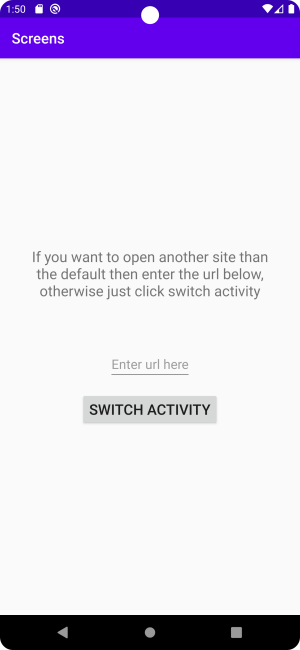
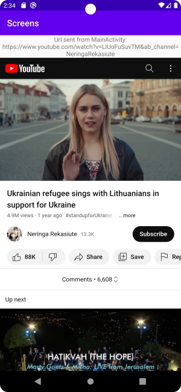

# Rapport

**Skriv din rapport här!**


För att lösa denna uppgift har ett program skrivits som tar en url som input ifrån användaren, startar en ny aktivitet, skickar med nämnda url till den nya aktivteten och visar denna i en TextView samt laddar den i en WebView precis nedanför. Programmets två aktiviteter heter MainActivity och VideoActivity(namnet pga att en video visas om ingen url fylls i). 

------------------------
 | 


I MainActivity finns en TextView med ett förklarande meddelande och en knapp som skapar den nya aktiviteten vid intryckning. Den url som laddas i den nya aktiviteten har skickats till den med en intent. Har användaren inte fyllt i någon url så skickas istället en default-url till aktiviteten. Detta sker i händelsehanteraren för knappen "Switch activity".   

```
public void onButtonClick(View view) {
        Intent switchIntent = new Intent(this, VideoActivity.class);
        String url = urlField.getText().toString();
		
		 /* if nothing has been entered by user we send a default url with the intent
         * otherwise we extract the entered string and send that 
         */
        if(url.isEmpty()) {
            switchIntent.putExtra("url", defaultUrl);
        }else {
            if( ! ( url.startsWith("http://") ) || url.startsWith(("https://") )) {
                url = "https://" + url;
            }
            switchIntent.putExtra("url", url);
        }
      
        startActivity(switchIntent);
        urlField.setText("", TextView.BufferType.EDITABLE); // set content of field to empty string
                                                            // in case the user returns to this activity
}
```        

Händelsehanteraren registrerades i knappens resurs-definition i activity_main.xml

För att skapa en till aktivitet så var tillägg tvunget att göras i AndroidManifest.xml i form av ett activity element där namnet på klassen som utgör den nya aktiviteten specificerades. 

```
<activity android:name=".VideoActivity">
     android:parentActivityName=".MainActivity"
</activity>
```

Denna nya aktivitet har en LinearLayout och en WebView, dessa definieras i layout-filen res/layout/activity_video.xml. Att det är denna som används försäkras genom anrop till setContenView() i VideoActivity.java i början av dess onCreate() metod. 

```
@Override
protected void onCreate(Bundle SavedInstanceState) {
     super.onCreate(SavedInstanceState);
     setContentView(R.layout.activity_video);
```
            
I VideoActivity.java så laddas en TextView för att visa den url som skickats med till VideoActivity. För att visa den url som skickats så ska den först extraheras ur den intent som användes för att starta aktiviteten. Intents skickar data i form av nyckel/värde par, därmed kan den url som skickat extraheras genom ett anrop till getIntent() och därefter intent.getStringExtra("url"), där strängen ""url" är en nyckel till url:en 

Då detta gjorts så laddas en WebView för att visa sidan som finns på addressen. Denna laddas med hjälp av findViewById() och kopplas sedan till en  WebVeiwClient för att den laddade url:en skall visas i appen och inte en extern webbläsare.  

```
 @Override
    protected void onCreate(Bundle SavedInstanceState) {
        super.onCreate(SavedInstanceState);
            setContentView(R.layout.activity_video);

        /* Create string to display above WebView */
        intent = getIntent();
        String url = intent.getStringExtra("url"); // URL is extracted from intent here
        TextView urlText = findViewById(R.id.url_invid);
        urlText.setText("Url sent from MainActivity: " + url);

        webview = findViewById(R.id.youtube);
        webview.setWebViewClient(new WebViewClient());
        webSettings = webview.getSettings();
        webSettings.setJavaScriptEnabled(true);


        Log.i("VideoActivity", "url from intent is " + url);
        webview.loadUrl(url);
    }
```


I VideoActivity så definierades även händelsehanteraren onBackPressed() för att det skulle gå att gå bakåt till den tidigare aktiviteten och även navigera sig om användaren klickat sig framåt till andra hemsidor med hjälp av länkar. 

```
    /* This event handler allows the user to go back to the previous activity by
     * clicking the system back button and also navigate among sites
     */
    @Override
    public void onBackPressed() {
        if(webview.canGoBack())
            webview.goBack();
        else
            super.onBackPressed();

    } 
```
    